# Introduction
Bienvenue sur mon blog ! J'ai récemment entrepris de résoudre le challenge de calibration de caméra de Comma.ai, un problème de vision par ordinateur passionnant dans le monde de la conduite semi-autonome
<!-- Mon approche m'a finalement permis de me hisser à la Xème place du classement -->
, et j'ai eu envie de partager cette expérience. 
Cet article retrace donc mon parcours, en expliquant pas à pas ma tentative pour résoudre ce défi technique.
## Contexte
Comma.ai est une entreprise qui cherche à démocratiser la conduite autonome. Là où Tesla vend des voitures complètes, comma.ai développe Openpilot : un système open-source qui transforme votre voiture existante en véhicule semi-autonome.

C'est une sorte d'équivalent d'Android face à iOS, mais pour les voitures.

Ils proposent un [ensemble de challenges publics](https://comma.ai/leaderboard) sur leur github, avec un prix à la clé pour la première personne parvenant à résoudre le challenge, et un classement public qui est maintenu au fil du temps.

Un challenge en particulier a attiré mon attention, bien qu'il ait été publié il y a quelques années et que le prix ait été remporté depuis longtemps. Il s'agit du challenge de calibration de caméra embarquée dans une voiture semi-autonome.
## Le problème à résoudre
Dans les voitures équipées du système Openpilot, un dispositif dédié comma.ai (comme le comma 3X) sert de caméra principale. Contrairement aux Tesla où les caméras sont fixées à des positions précises en usine, chaque installation d'Openpilot est unique : le dispositif peut être placé à différentes positions sur le pare-brise, avec différentes orientations. Pour que le système d'assistance à la conduite fonctionne correctement, il doit comprendre comment le dispositif et ses caméras sont orientés par rapport à la voiture. C'est ce qu'on appelle la calibration de caméra.

<figure>
  
  <figcaption>Exemple d'un dispositif comma.ai positionné dans le cockpit d'une voiture</figcaption>
</figure>

## L'objectif
Ce challenge demande de développer un algorithme qui, à partir d'une vidéo prise par le dispositif comma.ai pendant la conduite, peut déterminer dans quelle direction la voiture se déplace par rapport à l'orientation de la caméra.

Pour décrire cette direction de déplacement de manière précise dans le référentiel de la caméra, je dois prédire deux angles clés pour chaque image de la vidéo:
- **Pitch (φ)** : L'angle vertical entre l'axe de la caméra et la direction de déplacement. Le pitch observable (φₒ) est influencé par :
	- Les mouvements verticaux de la voiture (freinage, accélération, dos d'âne)
	- L'orientation verticale fixe de la caméra par rapport à la voiture
	-  φ > 0 : la voiture accélère / monte sur un dos d'âne
	- φ < 0 : la voiture freine / descend d'un dos d'âne
- **Yaw (θ)** : L'angle horizontal entre l'axe de la caméra et la direction de déplacement. Le yaw observable (θₒ) est influencé par :
	- La trajectoire de la voiture (virages à droite ou à gauche)
	- L'orientation horizontale fixe de la caméra par rapport à la voiture
	- θ > 0 : la voiture tourne à droite
	- θ < 0 : la voiture tourne à gauche

### L'épipole
En vision par ordinateur, le point vers lequel la voiture se dirige est appelé "**épipole**". C'est le point où convergent les trajectoires des objets stationnaires lorsque la caméra se déplace en ligne droite. 
Avec la distance focale donnée de 910 pixels, on peut établir une relation directe entre les angles (pitch et yaw) et les coordonnées (x,y) de ce point dans l'image.
## Les données disponibles
Pour résoudre ce problème, j'ai accès à 10 vidéos d'une minute chacune, soit environ 1200 frames.
5 vidéos sont labellisées avec les angles corrects déjà identifiés, et 5 vidéos sont non labellisées.
Chaque vidéo montre des conditions de conduite différentes (environnement, luminosité, etc.)
<figure>
  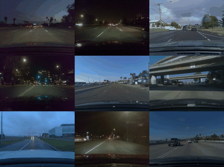
  <figcaption>Aperçu de 9 vidéos du dataset</figcaption>
</figure>

## Critère d'évaluation
Les prédictions sont évaluées sur une échelle où 0% correspond à une prédiction parfaite et 100% correspond au score qu'on obtient en prédisant simplement le centre de l'image. Plus le score est élevé, plus l'erreur est importante.
## Stratégies considérées
En analysant le leaderboard du challenge, j'ai remarqué un agglutinement de scores autour de 20%. Ce phénomène suggère fortement un plafonnement des approches classiques par réseaux de neurones (NN), probablement limités par la faible quantité de données d'entraînement disponibles (seulement 5 vidéos labellisées).

J'ai donc considéré trois approches principales :
1. **Deep Learning** : Bien que cette approche soit intuitive pour les problèmes de vision par ordinateur, la limitation des données m'a fait douter de sa capacité à dépasser le plafond observé sur le leaderboard.
2. **SLAM (Simultaneous Localization and Mapping)** : Mentionné dans l'énoncé comme méthode de validation.
3. **Optical Flow** : Technique qui estime le mouvement apparent des objets entre deux images consécutives en calculant un champ de vecteurs de déplacement. Méthode simple et interprétable.

Ma philosophie pour ce projet a été de privilégier la simplicité et l'itération rapide. Je préfère commencer par comprendre le problème avec des méthodes plus transparentes avant d'ajouter de la complexité si nécessaire.

Le flux optique présente plusieurs avantages qui m'ont convaincu d'explorer cette voie en premier :
- La méthode est **interprétable** : on peut visualiser les vecteurs de mouvement et comprendre intuitivement ce qui se passe
- Elle est **relativement simple à implémenter** avec des bibliothèques comme OpenCV

Surtout, il existe un lien conceptuel direct entre le flux optique et l'épipole qui rend cette approche particulièrement prometteuse. Pour comprendre cette relation, il faut imaginer ce qui se passe visuellement lorsque la voiture avance en ligne droite : les objets stationnaires de l'environnement (arbres, bâtiments, panneaux) semblent "s'écouler" vers l'arrière dans notre champ de vision, créant un effet de perspective où tous ces éléments paraissent diverger depuis un point central.

Ce point central depuis lequel tout semble diverger est précisément l'épipole : le point vers lequel la voiture se dirige. Le flux optique, en calculant les vecteurs de déplacement apparent de chaque élément entre deux images consécutives, capture mathématiquement ce phénomène visuel. En théorie, lorsque la caméra se déplace en ligne droite, tous les vecteurs de flux optique des points stationnaires de l'environnement pointent dans des directions qui s'éloignent de l'épipole.

Cette relation fondamentale fait du flux optique un outil naturel pour localiser l'épipole.
# 1er arc : Flux optique
Pour démarrer mon exploration, j'ai d'abord voulu établir une baseline avec l'approche la plus directe et intuitive possible. Dans cet arc, j'introduis le flux optique - une technique fondamentale qui restera au cœur de toutes mes approches tout au long de ce projet. 
## Implémentation du flux optique
Maintenant que le lien conceptuel entre flux optique et épipole est établi, il me fallait choisir comment implémenter concrètement cette approche pour exploiter cette relation géométrique.

Le package `opencv` propose deux méthodes principales pour calculer le flux optique :
- **cv2.calcOpticalFlowFarneback()** : dite "dense", cette méthode calcule le flux optique pour tous les pixels de l'image. Elle est particulièrement adaptée pour mesurer les mouvements continus et globaux, mais est plus coûteuse en calcul.
- **cv2.calcOpticalFlowPyrLK()** : dite "sparse", cette méthode ne calcule le flux optique que pour des points spécifiques préalablement identifiés (généralement des coins ou des points d'intérêt). Elle est plus rapide mais nécessite une sélection pertinente des points à suivre.

N'ayant pas de contrainte forte de temps de calcul et souhaitant mesurer le mouvement relatif global de l'environnement par rapport au véhicule, j'ai opté pour l'approche dense avec l'algorithme de Farnebäck. Cette méthode me permet d'obtenir un champ vectoriel complet qui représente le mouvement apparent entre deux frames consécutives.
### Visualisation
J'ai donc implémenté le calcul du flux optique dense entre frames consécutives, ce qui produit un champ de vecteurs comme illustré ci-dessous :
<figure>
  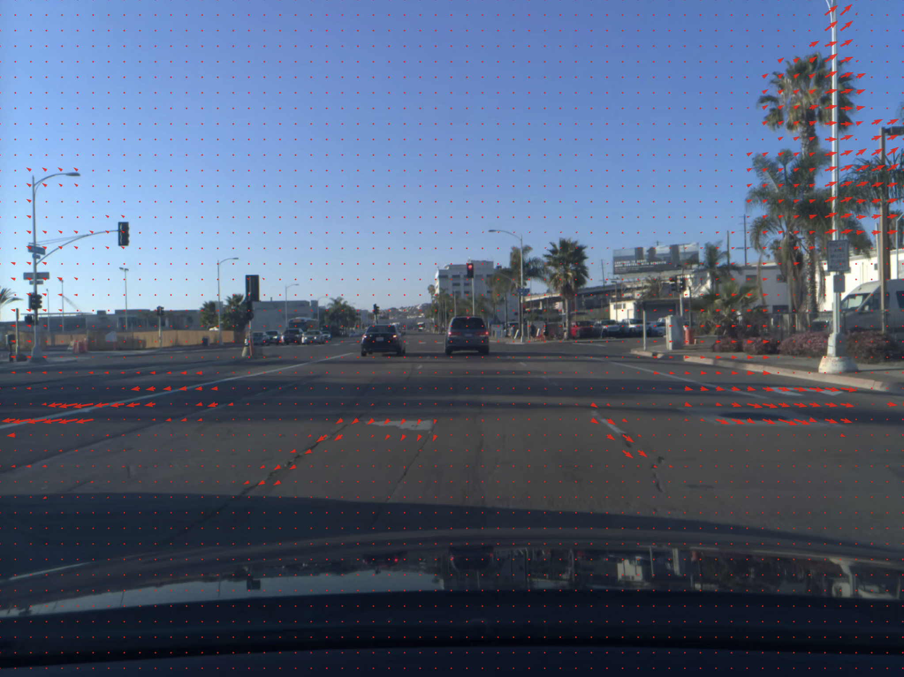
  <figcaption>Visualisation du champ de vecteurs de flux optique dense calculé entre deux frames consécutives</figcaption>
</figure>

Sur cette visualisation, chaque flèche représente le déplacement apparent d'un pixel entre deux frames. On peut observer que dans un scénario de déplacement en ligne droite, ces vecteurs semblent ou diverger depuis un point particulier - ça devrait être notre épipole.

## Première approche pour l'estimation de l'épipole

À partir du champ de vecteurs de flux optique obtenu, j'ai cherché à localiser l'épipole en utilisant une méthode intuitive basée sur l'analyse des changements de direction des vecteurs.

La méthode repose sur une observation fondamentale : dans un mouvement en ligne droite, les vecteurs de flux optique tendent à "s'écarter" du point vers lequel le véhicule se dirige (l'épipole). J'ai donc cherché à localiser ce point de convergence en analysant séparément les composantes horizontales et verticales du flux.

L'idée est simple : l'épipole correspond à l'endroit où les vecteurs changent de direction, tant horizontalement que verticalement. Verticalement, au-dessus de l'épipole, les vecteurs pointent majoritairement vers le haut, tandis qu'en dessous, ils pointent vers le bas. De même horizontalement, à gauche de l'épipole, ils pointent vers la gauche, et à droite, vers la droite. L'intersection de ces deux lignes de changement de direction devrait donc donner une estimation approximative de l'épipole.

<figure>

  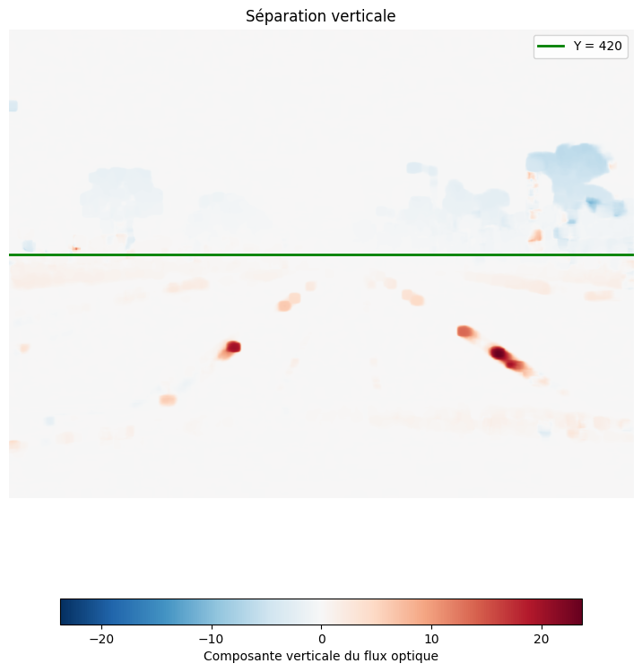
  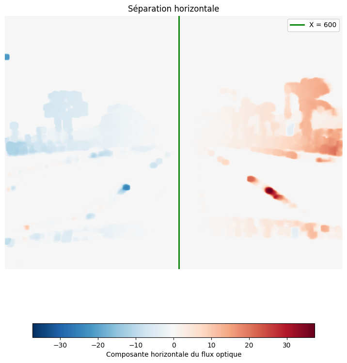

  <figcaption>Séparation verticale et horizontale des vecteurs de flux optique</figcaption>

</figure>

Isolons la méthode pour trouver l'axe de séparation vertical:

1. Pour chaque colonne $j$, je calcule la moyenne $m_j$ des composantes horizontales des vecteurs :
   $$m_j = \frac{1}{H} \sum_{i=1}^{H} x_{i,j}$$
   où $H$ est la hauteur de l'image et $x_{i,j}$ est la composante horizontale du vecteur à la position $(i,j)$.

2. Pour chaque position potentielle de séparation $s$, je calcule la différence entre les moyennes à droite et à gauche :
   $$\delta(j') = \sum_{j=j'+1}^{W} m_j - \sum_{j=1}^{j'} m_j$$
   où $W$ est la largeur de l'image.

3. Je sélectionne la position $j^*$ qui maximise cette différence :
   $$j^* = \arg\max_j \delta(j)$$

En appliquant cette méthode pour les axes horizontal et vertical, j'obtiens les coordonnées de ma première estimation de l'épipole en calculant le point d'intersection entre les deux lignes de séparation.

## Résultats et limitations
Avec cette méthode très simple, j'obtiens ma baseline - un score de **1960.20%**. Si vous vous demandiez s'il est possible de faire pire que 100%, vous avez votre réponse ! 

Bien que les figures présentées un peu plus haut montrent une séparation relativement claire sur certaines frames, cette méthode échoue complètement sur de nombreuses autres situations. Dans ces cas problématiques, les lignes de séparation se retrouvent collées aux bords de l'image, produisant des prédictions aberrantes. 

J'ai notamment identifié plusieurs éléments qui handicapent la prédiction de l'épipole avec cette technique, comme le capot de la voiture et les autres véhicules en mouvement dans la scène. Ce sont précisément ces problèmes que je vais adresser dans la section suivante.

<figure>
  
  <figcaption>Exemple de prédiction avec la méthode de l'arc 1</figcaption>
</figure>

# 2ème arc : Segmentation
## Problèmes identifiés avec la méthode précédente
Avec la méthode précédente basée uniquement sur le flux optique, certaines frames donnent des résultats acceptables, mais l'ensemble est très bruité. Dans certains cas, l'algorithme échoue complètement comme on peut le voir dans ces exemples:

  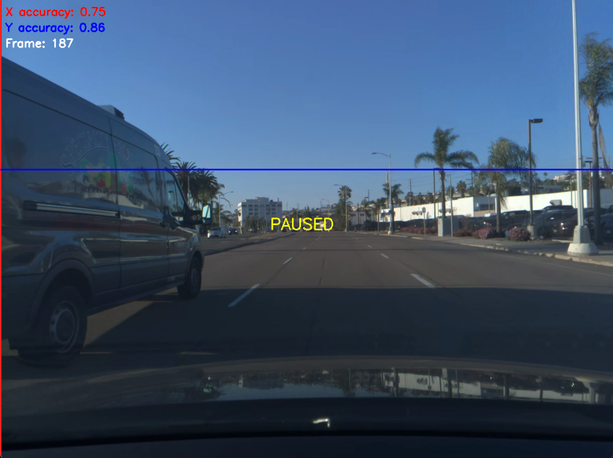
  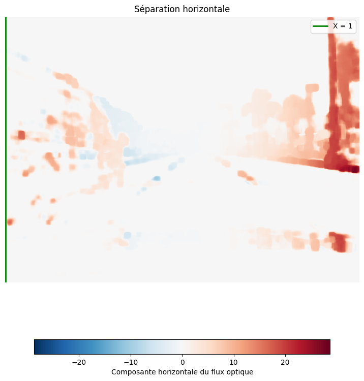

**Exemple 1 - Véhicules en mouvement:** Dans ce premier cas, une camionnette double la voiture, créant des vecteurs orientés vers la droite alors qu'ils sont situés à gauche de l'écran (les tâches rouges à gauche de la figure de gauche). La ligne de séparation verticale se retrouve alors collée à l'extrémité gauche, produisant une estimation aberrante.

  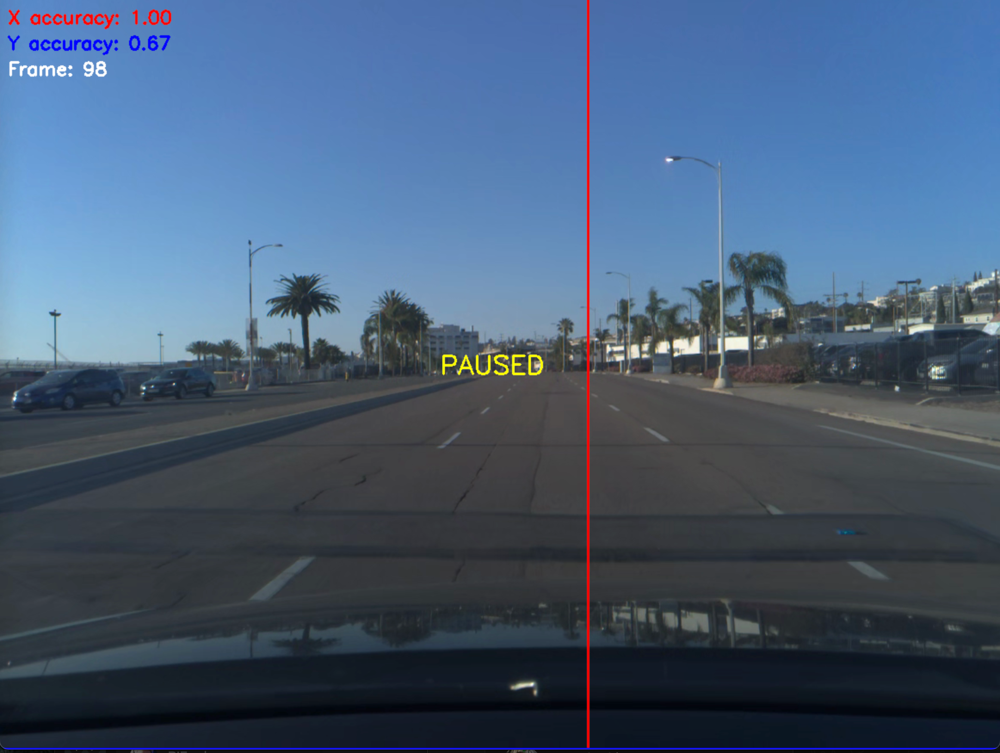
  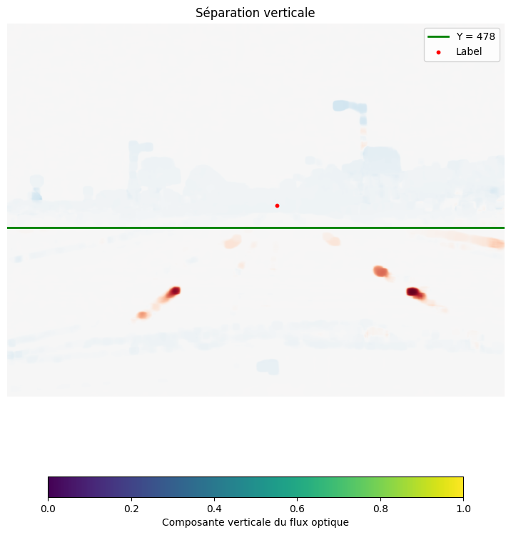

**Exemple 2 - Le capot de la voiture:** On observe ici que le capot de la voiture reflète le décor (les tâches bleues claires en bas de la figure à droite), créant des vecteurs qui pointent vers le haut alors qu'ils sont situés en bas de l'image. Cela pousse artificiellement la ligne de séparation horizontale vers le bas. Bien que moins prononcé que dans le premier exemple, cela fausse également l'estimation de l'épipole.

La solution devient évidente: il faut segmenter et ignorer à la fois le capot de la voiture et les éléments mobiles du décor (autres véhicules, piétons) susceptibles de fausser notre estimation.

## Choix des méthodes de segmentation
Après une brève recherche, j'ai identifié deux algorithmes prometteurs pour la segmentation:
### SAM 2 de Meta
SAM 2 de Meta est un modèle de segmentation très général, capable de traiter presque n'importe quel objet. Cependant, il est très lent et exigeant en ressources, ce qui le rend inadapté aux applications temps réel ou à une utilisation sur des machines personnelles.

J'ai été initialement attiré par les capacités de SAM 2, mais j'ai rapidement déchanté: même les versions les plus légères du modèle étaient difficiles à charger sur la puce M1 de mon Mac, et la version "large" n'avait toujours pas fini de charger après 20 minutes d'attente. Cette contrainte matérielle, que je m'étais imposée pour ce projet (utiliser uniquement mon Mac personnel), m'a poussé vers une alternative.
### YOLOv8-seg
Ce modèle présente plusieurs avantages:
- Rapide et efficace
- Excellente détection des véhicules et autres objets communs
- Compatible avec mes contraintes matérielles

J'ai donc opté pour YOLOv8-seg, qui s'est avéré rapide et globalement efficace pour la détection et la segmentation des véhicules:

<figure>
  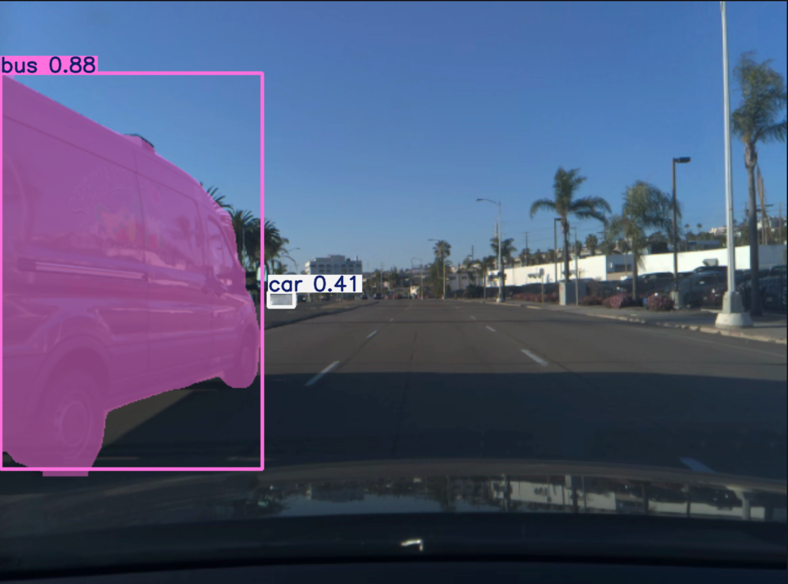
  <figcaption>Exemple de détection et de segmentation de véhicules avec YOLOv8-seg</figcaption>
</figure>

J'ai configuré YOLO pour qu'il segmente uniquement les véhicules, en excluant les éléments statiques du décor comme les feux tricolores, bien qu'il soit aussi capable de les détecter.

### Segmentation manuelle du capot
Un problème persistait cependant: YOLOv8 ne détecte pas le capot de la voiture, puisqu'il n'est pas entraîné pour cette tâche spécifique. J'ai donc développé rapidement une interface simple me permettant de segmenter manuellement le capot sur la première frame de chaque vidéo. Cette segmentation manuelle est ensuite appliquée à toutes les frames de la vidéo correspondante.
## Résultats et amélioration des performances
L'application de cette segmentation combinée (YOLOv8 pour les objets mobiles + segmentation manuelle du capot) a permis de réduire le score d'erreur à **812.57%**, représentant une amélioration d'environ 60% par rapport à la méthode basée uniquement sur le flux optique.

<figure>
  
  <figcaption>Exemple de prédiction avec la méthode de l'arc 2</figcaption>
</figure>

Bien que ce score reste très élevé et loin d'être satisfaisant, cette amélioration confirme l'importance de la segmentation dans notre approche. Cette étape de prétraitement sera conservée et utilisée dans toutes les méthodes suivantes.
# 3eme arc : nouvelle méthode pour estimation de l'épipole.
## Principe du score de colinéarité
Dans cette nouvelle approche, je m'attaque directement au problème fondamental : comment trouver le point de convergence des vecteurs de flux optique (l'épipole) de manière plus précise ?
Lorsque le véhicule dans lequel la caméra est embarqué se déplace en ligne droite, tous les objets stationnaires semblent "s'écouler" depuis un point unique - l'épipole. Ce phénomène crée un champ de vecteurs avec une propriété géométrique essentielle : les vecteurs de flux optique des objets stationnaires pointent dans des directions qui s'éloignent de l'épipole.

Puisque la position de l'épipole est inconnue, l'approche consiste à tester plusieurs "points candidats". Pour chaque candidat, on calcule un score de colinéarité global pour évaluer sa plausibilité.
Pour chaque pixel p avec un vecteur de flux optique $\vec{v}(p)$, et un point candidat e, je calcule :
- Le vecteur normalisé du flux optique :  
$$\hat{v}(p) = \frac{\vec{v}(p)}{\|\vec{v}(p)\|}$$
- Le vecteur normalisé allant du pixel vers l'épipole candidat :  
$$\hat{d}(p) = \frac{e - p}{\|e - p\|}$$    
- Le score de colinéarité individuel pour ce pixel :
$$s(p) = \hat{v}(p) \cdot \hat{d}(p)$$
Ce produit scalaire vaut 1 si les vecteurs sont parfaitement alignés, 0 s'ils sont perpendiculaires, et -1 s'ils pointent dans des directions opposées.

<figure>
  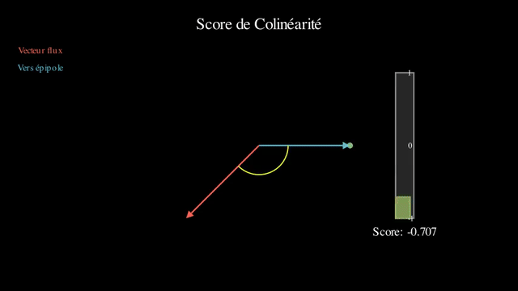
  <figcaption>Exemple de calcul du score de colinéarité pour un pixel</figcaption>
</figure>

Le score de colinéarité global pour un point candidat e est alors la moyenne de ces scores individuels :
$$S(e) = \frac{1}{|P|} \sum_{p \in P} s(p)$$
Où P est l'ensemble des pixels dans l'image.

<figure>
  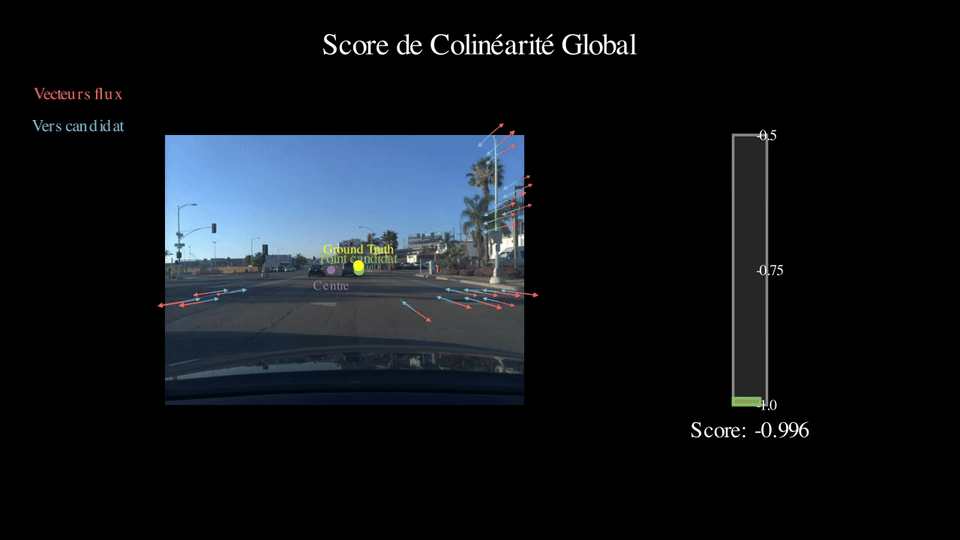
  <figcaption>Exemple de calcul du score de colinéarité global pour un point candidat</figcaption>
</figure>

Puisque les vecteurs de flux optique devraient pointer dans la direction opposée au vecteur allant du pixel à l'épipole (pour les objets stationnaires), l'objectif est de trouver le point $e^*$ qui minimise ce score :
$$e^* = \arg\min_{e} S(e)$$
Cette méthode transforme notre problème en une tâche d'optimisation : trouver le point qui minimise le score de colinéarité global.
## Approche par optimisation
Pour optimiser mon estimation de la position de l'épipole sur l'image, j'ai donc besoin de minimiser le score de colinéarité global.
### Filtrage préliminaire des vecteurs
Lors de mes observations initiales des champs de vecteurs de flux optique, j'ai remarqué un phénomène important: les vecteurs de grande amplitude pointent généralement dans la direction opposée à l'épipole de manière cohérente, tandis que les vecteurs de très petite norme présentent un comportement beaucoup plus bruité.

Pour améliorer la robustesse de mon estimation, j'ai donc décidé d'appliquer un filtrage simple : éliminer tous les vecteurs dont la norme est inférieure à $10^{-2}$. Ce seuil a été choisi un peu arbitrairement d'après mes observations. J'ai décidé de regarder ça de plus près dans la prochaine itération du projet.
### Méthode d'optimisation

En visualisant le **score de colinéarité global** (défini précédemment) pour différentes positions candidates, j'observe que la fonction-objectif à minimiser présente une forme généralement **convexe**, ce qui la rend idéale pour l'optimisation.

<figure>
  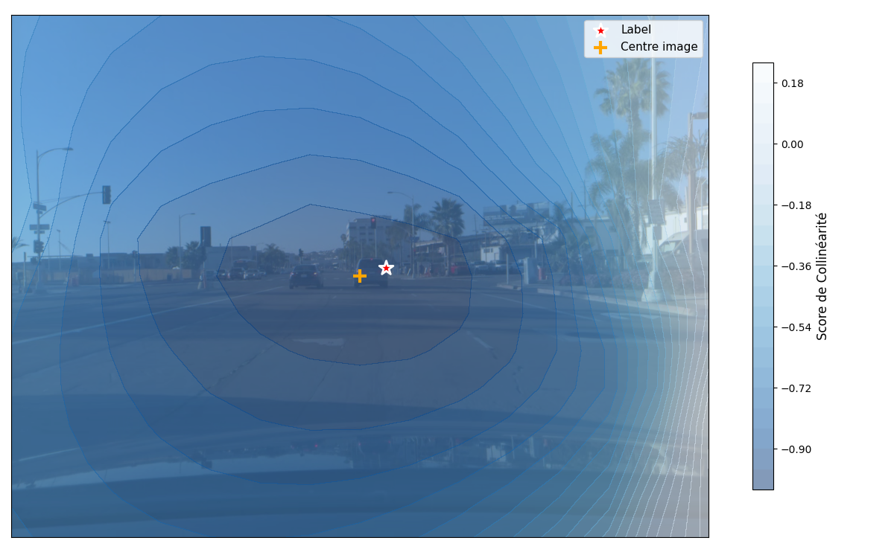
  <figcaption>Visualisation du score de colinéarité global pour des positions candidates couvrant toute l'image. La forme de "cuvette" est caractéristique d'une fonction convexe.</figcaption>
</figure>

Cette propriété m'a conforté dans le choix d'une **méthode d'optimisation basée sur le gradient** pour trouver le minimum de manière efficace.

Bien qu'une descente de gradient classique soit une option, j'ai choisi une approche plus sophistiquée : l'algorithme **L-BFGS-B** (Limited-memory BFGS with Bounds). Il s'agit d'une méthode **quasi-Newton** qui offre un excellent compromis performance/coût :
Il converge en beaucoup moins d'itérations qu'une descente de gradient simple pour ce type de problème, bien que chaque itération soit plus complexe
## Paramètres du flux optique
Les vecteurs de flux optique constituent les données brutes utilisées par toutes les méthodes d'optimisation subséquentes. Il m'a donc paru essentiel d'optimiser leur qualité pour améliorer l'ensemble du processus d'estimation de l'épipole.

Pour cela, j'ai optimisé les paramètres de la fonction `cv2.calcOpticalFlowFarneback` d'OpenCV avec une grid search assez simple. L'objectif était de trouver les paramètres qui améliorent le score de colinéarité global pour les points fournis dans les labels.

Après une série de tests, j'ai identifié une configuration satisfaisante qui améliore le critère sans trop augmenter le temps de calcul. Les principaux ajustements concernent la pyramide d'échelle (`pyr_scale`, `levels`), la taille de la fenêtre d'analyse (`winsize`) et les paramètres de lissage polynomial.

## Résultats de cette nouvelle approche
Cette méthode donne une performance de **168.83%**, ce qui représente une amélioration d'environ 80% par rapport à l'itération précédente. 

Cette amélioration significative valide l'approche combinée: nouveau critère de colinéarité, méthode d'optimisation par descente de gradient, et paramétrage optimisé du flux optique.

<figure markdown>
  
  <figcaption>Exemple de prédiction avec la méthode de l'arc 3</figcaption>
</figure>

Voilà du progrès !
# 4ème arc : filtrage des vecteurs
## Repenser le filtrage
Dans l'itération précédente du projet, j'ai arbitrairement choisi de filtrer les vecteurs et ne garder que ceux dont la norme est supérieure à $10^{-2}$ car j'ai observé que les vecteurs plus petits avaient tendance à être plus bruités.
Mon intuition m'a mené à penser que creuser dans cette direction me mènerait à une amélioration significative des performances.
### Critères de filtrage envisagés
J'ai identifié trois critères prometteurs pour améliorer la sélection des vecteurs :
1) **Norme des vecteurs** : Basé sur l'observation mentionnée précédemment - les vecteurs de faible amplitude sont effectivement plus bruités.
2) **Score de colinéarité avec le centre** : Même parmi les grands vecteurs, certains pointent dans des directions aberrantes qui bruitent l'estimation. Puisque l'épipole reste généralement proche du centre de l'image, un vecteur qui ne "pointe" pas grossièrement vers la direction opposée au centre a peu de chances d'être informatif. Le score de colinéarité avec le centre constitue donc un bon proxy pour identifier les vecteurs utiles.
3) **Distance au centre** : Intuition qu'il pourrait exister une corrélation entre la distance d'un vecteur au centre et sa capacité à contribuer positivement à l'estimation de l'épipole.

Pour cette première exploration, j'ai retenu les deux premiers critères - ils me semblaient plus prometteurs et deux paramètres constituent déjà un bon point de départ.
### Stratégies de filtrage
J'ai ensuite considéré deux approches principales :

**Filtrage adaptatif vs général** : Utiliser du machine learning pour trouver des paramètres spécifiques à chaque frame, ou trouver des paramètres qui fonctionnent bien en moyenne sur toutes les frames. Avec peu de données d'entraînement disponibles, j'ai opté pour la simplicité : des paramètres généraux.

**Filtrage dur vs pondération** : Le filtrage dur élimine complètement certains vecteurs selon des critères binaires (ex: tous ceux de norme > 0.01), tandis que la pondération leur attribue des poids variables (ex: coefficient linéaire par rapport à leur score de colinéarité avec le centre). J'ai choisi de partir sur le filtrage dur en premier - plus simple à implémenter et à interpréter.
### Approche retenue
Ma stratégie est donc claire : filtrage dur avec paramètres généraux, appliqué sur la norme des vecteurs et leur score de colinéarité avec le centre. L'étape suivante consiste à trouver les valeurs optimales de ces paramètres.

## Accélération de l'estimation de l'épipole
### Motivation
J'ai fait des tests préliminaires sur des frames individuelles et j'ai observé que les paramètres optimaux pour le filtrage diffèrent d'une frame à l'autre. Il faut donc que je sois en mesure d'évaluer l'impact des filtres testés sur l'ensemble des frames pour trouver des paramètres qui fonctionnent bien en moyenne.

**Le problème** :Évaluer l'épipole sur l'ensemble des frames des 5 vidéos prend 1 à 2 heures. Si je veux évaluer l'impact de différents jeux de paramètres de filtrage, je ne peux tester que 12 à 24 combinaisons par jour en faisant tourner mon ordinateur en continu. Pour une exploration systématique nécessitant des centaines d'évaluations, ce n'est pas une solution envisageable.
**L'objectif** : Réduire le temps d'évaluation à ~10 secondes pour permettre l'exploration d'un large espace de paramètres avec des méthodes de recherche avancées.

Il faut donc que je trouve un moyen d'accélérer drastiquement l'évaluation de l'impact des paramètres de filtrage sur l'estimation de l'épipole.
### Optimisation par module
#### Retour sur la pipeline de prédiction
Pour trouver l'épipole sur une frame, ma méthode actuelle suit une pipeline séquentielle en trois modules :

<figure>
  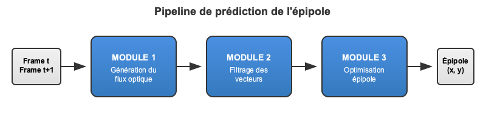
  <figcaption>Pipeline de prédiction de l'épipole</figcaption>
</figure>

**Module 1 : Génération du flux optique** - À partir de deux frames consécutives, je calcule le champ de vecteurs de flux optique avec l'algorithme de Farneback d'OpenCV, puis j'applique la segmentation pour éliminer les vecteurs correspondant aux véhicules en mouvement et au capot de la voiture.

**Module 2 : Filtrage des vecteurs** - J'applique des critères de sélection (seuil de norme, score de colinéarité) pour ne conserver que les vecteurs les plus informatifs pour l'estimation de l'épipole.

**Module 3 : Optimisation** - J'applique une descente de gradient pour minimiser le score de colinéarité présenté au troisième arc, ce qui me donne les coordonnées finales de notre estimation de l'épipole pour une frame.

Dans cette section, nous suivrons mon cheminement visant à accélérer chacun de ces trois modules.
#### Module 1 : génération des champs de vecteurs de flux optique
**Précalcul des champs de vecteurs**
L'optimisation la plus évidente consiste à précalculer tous les champs de vecteurs de flux optique plutôt que de les recalculer à chaque évaluation de paramètres de filtrage. 

**Défis de stockage**
Cette stratégie m'a rapidement confronté à un problème pratique : les 5 fichiers générés pesaient chacun 10 Go (encodage float32 par défaut), saturant complètement la mémoire de mon Mac.

**Solution : quantification et compression**
J'ai donc exploré la quantification des vecteurs pour réduire l'empreinte mémoire. Pour évaluer l'impact de cette quantification, j'ai calculé l'erreur angulaire introduite en passant de float32 à float16 sur l'ensemble des vecteurs, puis analysé cette erreur en fonction de la taille des vecteurs.
Le résultat est rassurant : seuls les vecteurs appartenant aux plus petits déciles de la distribution des normes (c'est-à-dire les vecteurs de très faible amplitude) présentent une erreur angulaire supérieure à 1°. Or, ces vecteurs de faible amplitude sont précisément ceux qui sont les plus bruités d'après mes observations, et donc moins informatifs pour l'estimation de l'épipole. L'erreur introduite par la quantification devrait donc négligeable par rapport au bruit déjà présent dans ces vecteurs.
En combinant cette quantification avec la compression .npz, j'ai obtenu 5 fichiers de ~3 Go chacun, soit une réduction de 70% de l'espace de stockage. Cependant, j'ai finalement conservé les versions float32 pour privilégier les performances et utilisé le format .npy pour éviter le temps de décompression.

**Résultat**
Cette optimisation élimine complètement le temps de calcul du module 1 lors des tests de paramètres, permettant de passer directement au filtrage des vecteurs précalculés.

#### Module 2 : filtrage
**Le défi de performance** Maintenant que j'avais ces tenseurs de flux optique précalculés (un tenseur par vidéo, dimensions : n_frames × height × width × 2), il fallait paralléliser le filtrage des vecteurs. Ces opérations, initialement traitées frame par frame, représentaient un goulot d'étranglement majeur dans ma pipeline lorsqu'appliquées sur des milliers de frames.

**Contraintes matérielles et choix technologiques** Travaillant sur un Mac M1 Pro, j'ai été confronté à une limitation connue : JAX (une bibliothèque de calcul numérique accéléré) n'exploite pas efficacement le GPU de cette architecture. Deux options s'offraient à moi :
- Chercher un serveur externe pour mes calculs
- Trouver une bibliothèque mieux adaptée à ma puce

Par curiosité et pour tester les limites des capacités de mon hardware, j'ai opté pour la seconde option. Mes recherches m'ont mené à **MLX**, la bibliothèque développée par Apple spécifiquement pour leurs puces. Les premiers tests ont été convaincants : une accélération notable par rapport aux calculs séquentiels.

**Stratégie de parallélisation pour le filtrage** J'ai implémenté une parallélisation à deux niveaux spécifiquement pour optimiser le filtrage des vecteurs :
- **Parallélisation sur les pixels** : Le calcul du score de colinéarité, qui prenait initialement 1 seconde par frame en mode séquentiel, a été réduit à 3 millisecondes grâce au calcul vectorisé sur GPU. Cette amélioration d'un facteur 300 transformait une opération critique en calcul quasi-instantané.
- **Parallélisation sur les frames** : En traitant les vidéos par batches adaptés à la capacité GPU, j'ai pu calculer les scores de colinéarité sur toutes les frames d'une vidéo en 3-4 secondes contre plusieurs minutes auparavant.

Grande victoire sur l'accélération de la vitesse de traitement sur ce module.
#### Module 3 : optimisation
**Un module critique pour l'évaluation**
Ce troisième module occupe une position particulière dans ma pipeline : étant en dernier, c'est lui qui produit la prédiction finale de l'épipole. Par conséquent, c'est également à ce niveau que j'évalue l'impact de chaque jeu de paramètres de filtrage sur la qualité des résultats. Pour optimiser efficacement mes paramètres, je dois pouvoir tester rapidement des milliers de combinaisons différentes.

**Le goulot d'étranglement de L-BFGS-B**
Jusqu'à présent, j'utilisais l'algorithme L-BFGS-B de `scipy.optimize` pour l'estimation de l'épipole. Cette méthode fonctionnait bien individuellement, mais présentait un problème majeur pour mon objectif d'optimisation : **elle n'est pas parallélisable**. Évaluer l'impact de différents paramètres de filtrage sur des centaines de frames nécessiterait des calculs séquentiels durant des heures.

Face à cette limitation, j'ai brièvement considéré une alternative radicale : abandonner complètement la descente de gradient et évaluer directement la qualité du filtrage via le score de colinéarité au niveau des labels. Bien que séduisante par sa facilité de parallélisation, cette approche présentait un risque conceptuel trop important - rien ne garantissait que de bons scores de colinéarité locale mèneraient à une convergence correcte de l'optimisation globale.

**Le pari sur Adam**
J'ai donc opté pour l'implémentation d'Adam from scratch, motivé par deux facteurs principaux : ma **familiarité avec cet algorithme** (facilement interprétable et débogable) et sa **robustesse** démontrée sur une large gamme de problèmes. Mon espoir était de pouvoir paralléliser cette implémentation avec MLX.

**L'échec de la parallélisation et le choix pragmatique**
Cette stratégie s'est heurtée aux limitations techniques de MLX : contrainte de scalarité pour le calcul des gradients, absence de jacobienne native, et inefficacité de la vectorisation automatique. J'ai brièvement considéré implémenter moi-même le calcul de jacobienne, mais par souci de temps, je me suis résigné à maintenir une approche séquentielle.

Cependant, mes tests préliminaires sur quelques frames individuelles montraient qu'Adam convergait de manière satisfaisante avec une fonction de coût généralement convexe. J'ai donc décidé de conserver cette implémentation malgré l'absence de parallélisation, faisant du module 3 mon principal goulot d'étranglement dans la pipeline d'optimisation.

**Paramétrage et early stopping optimisé**

N'ayant pas réussi à paralléliser la descente de gradient, mon objectif principal était de **réduire le temps de calcul** du module d'optimisation. Partant d'une approche simple de **50 itérations fixes**, j'ai implémenté un **early stopping basé sur la détection de plateau** : l'optimisation s'arrête lorsque la fonction de coût n'améliore pas de plus de 1e-4 pendant 3 itérations consécutives.

Cette modification a effectivement permis de **réduire le temps de calcul de 3 à 5 fois**. Mais de manière inattendue, j'ai également observé une **amélioration des performances** en termes d'erreur par rapport aux labels.

En analysant ce phénomène surprenant, j'ai compris que converger jusqu'au fond de la fonction convexe éloignait souvent la prédiction du centre de l'image. Dans les cas où la direction d'optimisation n'est pas parfaitement alignée avec l'épipole réel, s'arrêter prématurément évite de s'éloigner excessivement et maintient la prédiction plus proche du label.

Cette stratégie d'arrêt prématuré s'est donc révélée doublement bénéfique : accélération du calcul ET amélioration de la précision.

<figure>
  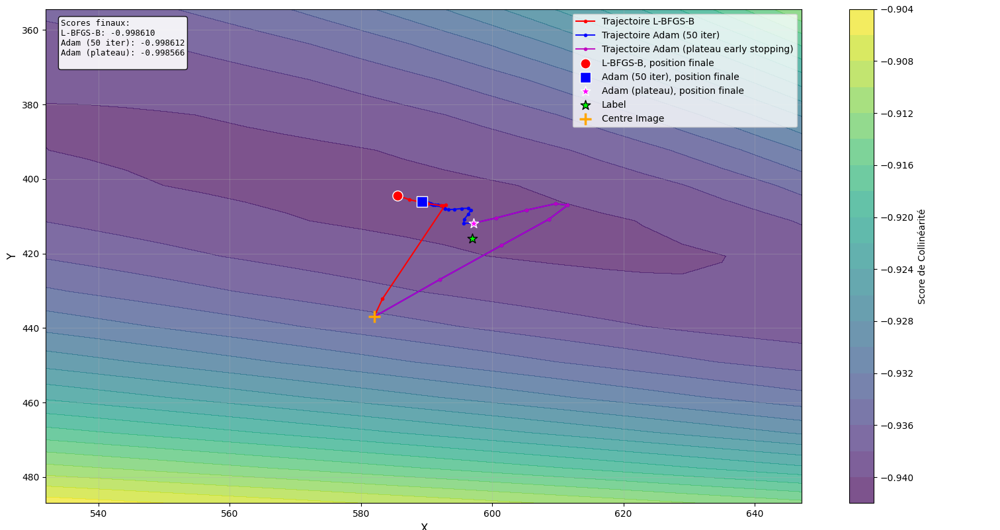
  <figcaption>Trajectoires de différents optimisateurs pour une frame</figcaption>
</figure>

À ce stade, je privilégiais la vitesse d'exploration : valider rapidement que l'approche fonctionnait avant de peaufiner les détails. Cette stratégie pragmatique s'est avérée suffisante pour passer à l'étape suivante, où une évaluation plus rigoureuse deviendrait nécessaire.
#### Conclusion
Cette approche a donné des résultats mitigés. Le travail sur **le module 1** a effectivement permis de réduire significativement les temps de calcul en éliminant les recalculs redondants. En revanche, les gains obtenus sur **le module 2** (parallélisation du filtrage) se trouvent largement amoindris par le goulot d'étranglement rencontré au **module 3** : l'impossibilité de paralléliser les descentes de gradient force un traitement séquentiel qui limite l'impact des optimisations précédentes.

Quoi qu'il en soit, à ce stade l'évaluation d'un jeu de paramètre nécessite encore 2 à 3 minutes de calcul sur l'ensemble des frames et  n'est pas suffisante pour tester rapidement un grand nombre de combinaisons de paramètres. Pour explorer efficacement l'espace des paramètres sans attendre des jours, il fallait être plus créatif et trouver une approche alternative au problème.
### Stratégie d'échantillonnage intelligent
Pour accélérer l'exploration de l'espace des paramètres, j'ai opté pour une approche d'échantillonnage stratégique. La clé était de construire un sous-ensemble échantillonné aussi représentatif que possible de l'ensemble original pour un nombre de frames minimal. Pour cela, j'ai procédé en trois étapes :
1. **Caractérisation des erreurs** : J'ai d'abord calculé les erreurs de prédiction sur l'ensemble des frames en utilisant des paramètres de filtrage simple
2. **Stratification par performance** : J'ai ensuite obtenu la distribution de ces erreurs pour chaque vidéo et organisé les frames en déciles selon leur niveau d'erreur
3. **Échantillonnage équilibré** : J'ai sélectionné 2 frames par décile et par vidéo, obtenant ainsi un échantillon de 100 frames couvrant uniformément le spectre de difficulté

Cette stratégie garantit que l'échantillon contient à la fois des frames "faciles" (faible erreur) et "difficiles" (forte erreur) malgré sa petite taille.

**Résultat**
L'évaluation des paramètres de filtrage sur ces 100 frames soigneusement sélectionnées ne prend plus que 2-3 secondes, permettant enfin une exploration efficace de l'espace des paramètres.
## Recherche des paramètres et résultats
### Stratégie de recherche des paramètres
Une fois que j'avais une méthode d'évaluation suffisamment rapide, il fallait choisir une stratégie pour explorer l'espace des paramètres de filtrage. Plusieurs approches s'offraient à moi :

1. **Exploration manuelle** : Recherche intuitive basée sur l'observation des résultats
2. **Recherche exhaustive** : Balayage systématique d'un espace de paramètres restreint
3. **Optimisation bayésienne** : Approche probabiliste pour guider la recherche.
4. **Métaheuristiques** : Algorithmes génétiques ou autres méthodes évolutionnaires.

J'ai privilégié les deux premières options pour leur **simplicité d'implémentation**, le fait qu'elles sont potentiellement suffisantes pour obtenir de bons résultats à ce stade du projet, et surtout parce que **l'espace de recherche se limite à seulement deux paramètres** (seuil de colinéarité et seuil de norme), ce qui rend l'exploration exhaustive et l'analyse visuelle parfaitement réalisables.

**Ma stratégie** : commencer par un balayage systématique large (approche 2), puis affiner manuellement la zone identifiée comme prometteuse (approche 1). Cette combinaison, bien que simple et sujette à rater des minima locaux, m'a semblé être un bon compromis.
### Résultats
L'exploration de l'espace des paramètres a permis d'identifier les valeurs suivantes pour les paramètres de filtrage :
- **Seuil de colinéarité** : 0.96
- **Seuil de norme** : 13

<figure>
  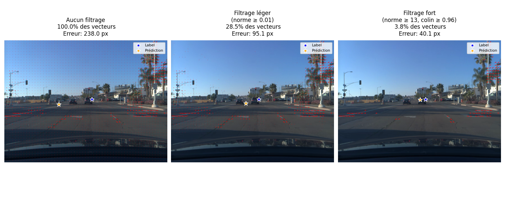
  <figcaption>Comparaison de champs de vecteurs de flux optique pour différents paramètres de filtrage</figcaption>
</figure>

Ces paramètres ont produit un **score de 54.32%**, représentant une amélioration significative de 60% par rapport à l'itération précédente. Cette performance marque l'entrée dans une fourchette de résultats acceptables, tout en conservant un potentiel d'amélioration substantiel pour les optimisations futures.

<figure markdown>
  
  <figcaption>Exemple de prédiction avec la méthode de l'arc 4</figcaption>
</figure>

# 5ème arc : amélioration du filtrage et post-processing
## Partie 1 : améliorations du pipeline
### Filtre
#### Sigmoïde
Dans l'arc précédent, j'avais opté pour un filtrage binaire "dur" sur les vecteurs de flux optique : les vecteurs dont la norme était inférieure à 13 étaient simplement éliminés du calcul. Bien que cette approche ait démontré son efficacité en produisant des résultats satisfaisants, elle limitait la flexibilité des méthodes de filtrage que je pouvais tester.

Cette rigidité m'a conduit à explorer une approche plus nuancée combinant filtrage et pondération. L'objectif était de trouver une fonction mathématique suffisamment générale pour exprimer un large éventail de stratégies de filtrage, tout en conservant un nombre de paramètres gérable pour l'optimisation.

La fonction sigmoïde s'est imposée comme la solution idéale :
$$
sig(x, θ, α) = \frac{1}{1+e^{-α(x-θ)}}
$$
où :
- θ : seuil/centre de la sigmoïde
- α : raideur/pente de la transition

<figure>
  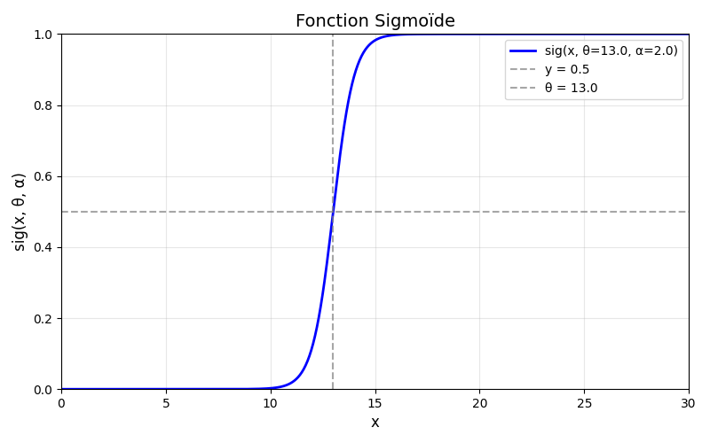
  <figcaption>Fonction sigmoïde</figcaption>
</figure>

Cette formulation présente plusieurs avantages déterminants. 
D'une part, elle englobe naturellement les cas extrêmes : un paramètre $k$ très élevé reproduit un filtrage binaire classique (eg. le filtre "dur" mentionné précédemment est exprimé par $sig(x,13,\infty)$), tandis qu'une valeur de $k$ faible génère une pondération linéaire. 
D'autre part, elle se limite à seulement deux paramètres à optimiser, préservant ainsi la tractabilité de l'espace de recherche.

<figure>
  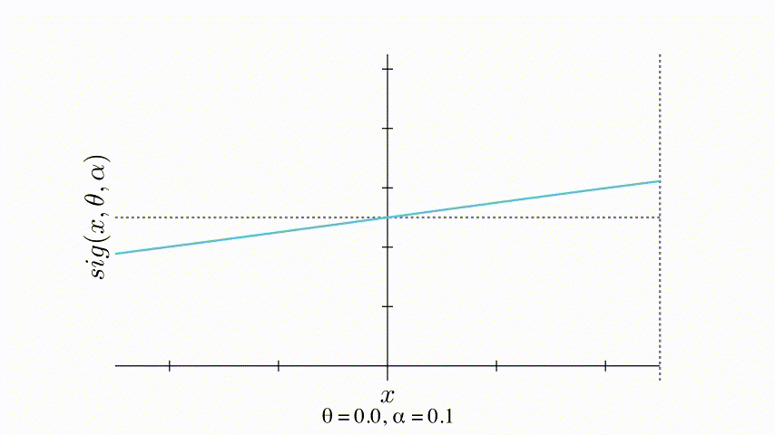
  <figcaption>Fonction sigmoïde pour différents paramètres de seuil et de raideur</figcaption>
</figure>

Cette généralité permet d'explorer de manière unifiée différentes stratégies de filtrage, simplifiant considérablement le processus d'expérimentation.

**Formulation mathématique du filtrage pondéré**

Pour chaque vecteur de flux optique $v_i$, j'évalue deux caractéristiques :
1. **La norme du vecteur** : $\|v_i\|$ 
2. **Le score de colinéarité avec le point de référence** : $c_i$

Chaque vecteur $v_i$ est ensuite transformé selon :

$$v'_i = v_i \cdot sig(\|v_i\|, θ_{norm}, α_{norm}) \cdot sig(c_i, θ_{col}, α_{col})$$
Cette approche unifie filtrage dur et pondération douce dans un cadre mathématique 
cohérent avec seulement 4 paramètres à optimiser.

#### Amélioration du critère sur la colinéarité

Pour rappel, dans l'arc précédent, je calculais pour chaque vecteur du flux optique un score de colinéarité avec pour point de référence le centre de l'image afin de m'assurer que les vecteurs retenus pointent grossièrement dans la direction opposée au centre de l'image.

L'utilisation du centre de l'image comme point de référence pour le calcul du score de colinéarité dans le filtrage des vecteurs présente une limitation conceptuelle : **ce point de référence n'est pas optimal**. Prendre la moyenne des prédictions d'une expérience précédente comme point de référence devrait naturellement améliorer le filtrage, puisque ce point sera plus proche des véritables prédictions à effectuer.

**Le problème avec le centre fixe :**
Au-delà de cette considération générale, j'ai observé un cas spécifique problématique : lorsque l'épipole réel est éloigné du centre de l'image, des vecteurs situés entre l'épipole et le centre peuvent être incorrectement filtrés. Ces vecteurs pointent correctement dans la direction opposée à l'épipole, mais obtiennent un mauvais score de colinéarité avec le centre et se font donc exclure.

**La solution :**
Plutôt que d'utiliser systématiquement le centre de l'image comme point de référence, je me donne la **possibilité d'utiliser le point moyen des prédictions d'une génération précédente** pour chaque vidéo. La méthode consiste à :

1. Effectuer une première passe de prédictions (peu importe le point de référence utilisé pour le calcul de colinéarité)
2. Calculer le point moyen de toutes les estimations d'épipole obtenues pour chaque vidéo
3. Utiliser ces nouveaux points moyens comme référence pour le calcul du score de colinéarité lors du filtrage des vecteurs dans une nouvelle expérience

Cette approche permet en principe d'améliorer le filtrage des vecteurs, puisque le point de référence est plus proche des véritables prédictions à effectuer.

#### Heatmap de colinéarité

À ce stade du projet, une question m'a intrigué : **tous les pixels de l'image contribuent-ils équitablement à la qualité de l'estimation ?** Mon intuition était que certaines zones pourraient systématiquement fournir des vecteurs plus informatifs - peut-être en raison de la géométrie de la scène ou des patterns de mouvement récurrents.

Pour explorer cette hypothèse, j'ai décidé de créer une "carte de chaleur" (heatmap) montrant quelles régions de l'image produisent historiquement les meilleurs scores de colinéarité. L'objectif était double : d'abord comprendre s'il existe effectivement des zones privilégiées, puis potentiellement exploiter cette information pour affiner le filtrage en donnant plus de poids aux régions les plus informatives.

Mais une question méthodologique se posait : **par rapport à quel point de référence calculer ces scores de colinéarité ?** Cette question m'a naturellement conduit à explorer deux approches complémentaires.

##### Deux stratégies d'analyse spatiale
**Approche 1 : Heatmap absolue (coordonnées fixes)**
Dans cette première approche, je calcule la collinéarité moyenne des vecteurs de chaque pixel par rapport au **centre fixe de l'image** (largeur/2, hauteur/2). 

Pour chaque position absolue `(x,y)` dans l'image :
- Je calcule le score de collinéarité par rapport au centre fixe pour tous les vecteurs situés à cette position
- Je moyenne ces scores à travers toutes les frames et toutes les vidéos
- Résultat : "Le pixel situé à la position absolue `(x,y)` a en moyenne un score de collinéarité de X"

**Approche 2 : Heatmap relative (coordonnées centrées sur l'épipole)**
La première approche avait une limitation évidente : elle analysait les patterns par rapport au centre fixe de l'image, alors que l'épipole moyen peut varier d'une vidéo à l'autre. Dans cette seconde approche, je calcule les scores de collinéarité par rapport au **épipole moyen de chaque vidéo** plutôt qu'au centre fixe.

Pour chaque position relative à l'épipole :
- Je transforme les coordonnées : `position_relative = (x,y) - epipole_moyen_vidéo`
- Je calcule la collinéarité par rapport à l'épipole spécifique de chaque vidéo
- Je moyenne les scores par **position relative**, pas par position absolue
- Résultat : "Un pixel situé à 50px à droite de l'épipole (peu importe où est cet épipole dans l'image) a en moyenne un score de collinéarité de Y"

Cette approche visait à découvrir des patterns géométriques récurrents autour de l'épipole - par exemple, "les vecteurs situés 100 pixels en bas à droite de l'épipole sont-ils systématiquement plus informatifs ?" - indépendamment de la position absolue de l'épipole dans chaque vidéo.

##### Résultats obtenus
**Heatmaps absolues par vidéo (Approche 1) :**
Sur l'image suivante on peut voir la moyenne des scores de collinéarité par vidéo en coordonnées absolues :
<figure>
  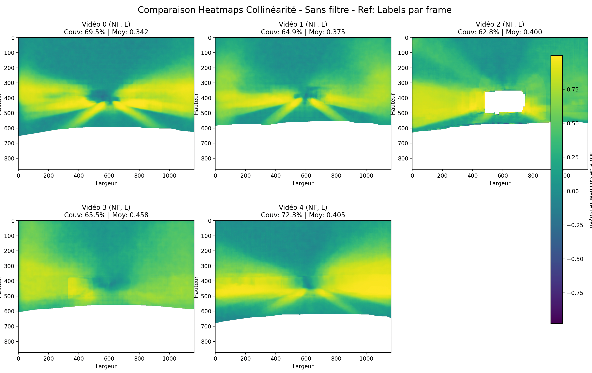
  <figcaption>Heatmap absolue par vidéo</figcaption>
</figure>
Observations :
- Des motifs se répètent : en bas de chaque image, une région blanche correspond au masque du capot de la voiture où les scores n'ont pas été calculés
- Des rais jaunes se distinguent nettement sous le point central des images 0, 1 et 4
- Les images 2 et 3 sont différentes : l'image 2 présente une région blanche correspondant à un véhicule masqué tout le long de la vidéo, l'image 3 n'a pas de motif clair

**Heatmap absolue globale (Approche 1) :**
Sur l'image suivante, on peut voir la moyenne des scores de collinéarité par pixel absolu, sur l'ensemble des vidéos :
<figure>
  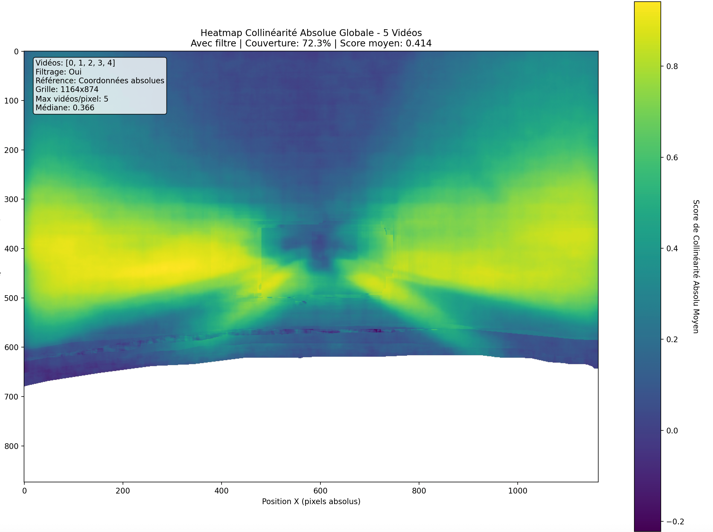
  <figcaption>Heatmap absolue globale</figcaption>
</figure>
Un motif clair similaire à celui apparaissant sur les images 0, 1 et 4 apparaît sur l'image globale.

**Heatmap relative globale (Approche 2) :**
J'ai également implémenté et testé cette approche pour voir si elle révélerait des patterns plus informatifs que l'approche absolue:

<figure>
  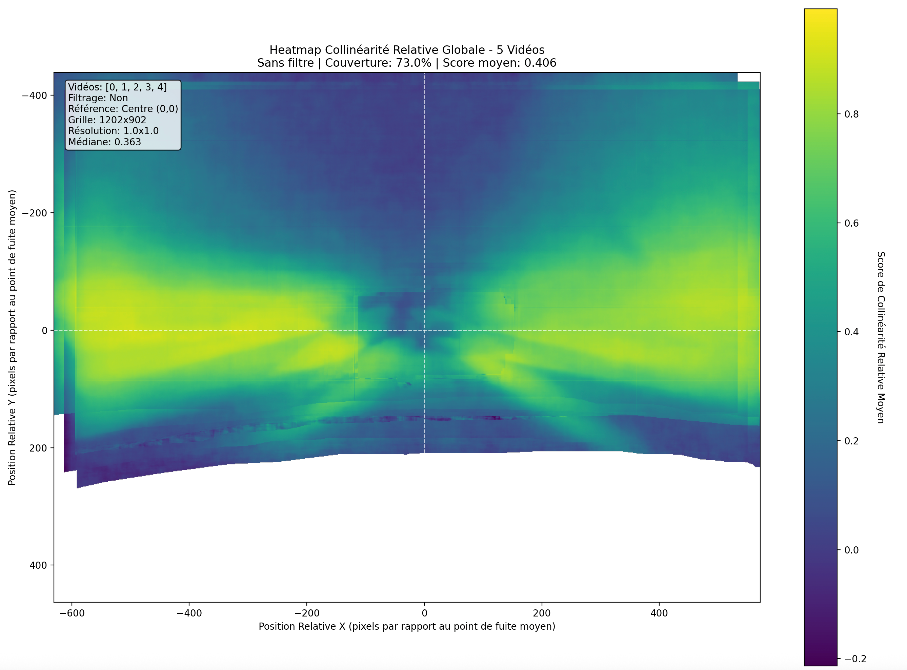
  <figcaption>Heatmap relative globale</figcaption>
</figure>

On observe que les patterns sont beaucoup moins nets que dans l'approche absolue. Par conséquent, j'ai décidé de conserver l'approche de la heatmap absolue globale pour la suite.
##### Utilisation de la heatmap absolue pour le filtrage
J'ai implémenté l'utilisation de cette heatmap absolue comme masque de coefficients lors du filtrage des vecteurs. L'idée est de donner plus d'importance aux vecteurs situés dans les régions qui ont historiquement de bons scores de collinéarité, et moins d'importance à ceux dans les régions moins informatives. 

Concrètement, j'ai introduit un **paramètre de pondération** compris entre 0 et 1 qui contrôle l'influence de la heatmap : 0 ignore complètement la heatmap, 1 lui donne une influence maximale. Cela permet de tester différents degrés d'exploitation de l'information spatiale dans le filtrage.

### Optimiseur
En analysant les estimations obtenues à l'issue du quatrième arc, j'ai observé quelque chose : sur les frames où l'écart entre le point prédit et le point labellisé était le plus important, l'erreur provenait notemment de l'optimiseur qui ne parvenait pas à atteindre le minimum de la fonction de colinéarité. Mon critère d'arrêt basé sur l'amélioration de la fonction de coût (arrêt lorsque l'amélioration devient inférieure à 1e-4 pendant 3 itérations consécutives) était tout simplement trop restrictif.

Plutôt que de chercher à trouver la bonne valeur de seuil pour le critère d'arrêt, j'ai décidé de changer le critère d'arrêt : arrêter l'optimisation lorsque la prédiction n'a pas bougé de plus de 1 pixel au cours des 5 dernières itérations.

Cette approche présente plusieurs avantages :
- Alignement avec l'objectif : Ce qui compte finalement, c'est une estimation précise au pixel près.
- Efficacité conservée : Le temps de calcul moyen reste similaire à l'approche précédente.
- Dans tous les cas observés, la prédiction est très proche du minimum global.

## Partie 2 : Post-processing
Depuis le 3ème arc de ce projet, j'observe que mes prédictions d'épipole, bien qu'améliorées à chaque itération, restent très bruitées et bénéficieraient probablement d'un lissage en post-processing. J'ai décidé de garder cette optimisation pour la fin du projet comme "cerise sur le gâteau" pour un petit bonus de performance.

#### Identification des frames valides

Un problème fondamental se pose lors de l'estimation de l'épipole : **sur certaines frames, le véhicule est à l'arrêt ou se déplace trop lentement** pour permettre une estimation fiable. Dans ces situations, les vecteurs de flux optique ont des normes très faibles et sont particulièrement bruités. Avec mes critères de filtrage actuels (seuil de norme ≥ 13), la quasi-totalité de ces vecteurs se trouvent éliminés, ne laissant pas suffisamment d'information pour l'optimisation.

Face à ce manque d'information, **mon algorithme se rabat sur une prédiction par défaut : le centre de l'image**. Cela évite les prédictions aberrantes mais ne reflète pas le mouvement réel du véhicule. Cette approche se trouve d'ailleurs confirmée par l'analyse des labels fournis dans le problème : certaines frames sont associées à des valeurs NaN, correspondant précisément aux situations où le véhicule est trop lent pour permettre une estimation fiable de l'épipole.

**Définition des frames valides et notation**
Pour le calcul des moyennes de lissage, je définis l'ensemble des **frames valides** $V$ comme l'ensemble des frames où le véhicule a une vitesse suffisamment élevée pour produire une estimation d'épipole fiable (c'est-à-dire différente du centre de l'image). 

Pour clarifier les calculs de lissage, je note $p_1, p_2, \dots, p_{\|V\|}$ la séquence des prédictions des frames valides **ordonnées temporellement**. Ainsi, $p_i$ correspond à la $i$-ème prédiction valide dans l'ordre chronologique, et $p_{i-1}$ désigne la prédiction valide qui la précède immédiatement. Ces prédictions ordonnées sont les seules utilisées dans les calculs de lissage, évitant ainsi de biaiser artificiellement les résultats vers le centre de l'écran.

#### Méthodes de lissage implémentées

J'ai exploré trois approches de lissage, de la plus simple à la plus sophistiquée :

**1. Moyenne simple**
La méthode la plus directe consiste à calculer la moyenne arithmétique de toutes les prédictions des frames valides, puis d'assigner cette valeur moyenne à chaque frame valide :
$$\bar{p} := \frac{\sum_{i=1}^{|V|}{p_i}}{|V|}$$
$$\forall i \in \{1, ..., |V|\} : \tilde{p_i} = \bar{p}$$
Cette approche donne le même poids à toutes les frames valides, indépendamment de leur position temporelle, et assigne la même prédiction lissée à toutes ces frames.

**2. Moyenne exponentielle**
Cette méthode pondère les observations de manière décroissante dans le temps, donnant plus d'importance aux prédictions récentes :
$$\tilde{p}_1 = p_1 \quad \text{(première prédiction valide)}$$
$$\forall i \in \{2, ..., |V|\} : \tilde{p}_i := \alpha \cdot p_i + (1- \alpha) \cdot \tilde{p}_{i-1}$$
où $\alpha \in [0,1]$ contrôle la vitesse d'adaptation : une valeur proche de 1 privilégie les observations récentes, tandis qu'une valeur proche de 0 maintient une mémoire plus longue des prédictions passées.

**3. Moyenne exponentielle bi-directionnelle**
Cette approche combine les avantages du lissage exponentiel dans les deux directions temporelles. Pour chaque prédiction valide $p_i$, je calcule deux lissages exponentiels séparés :

- Un lissage **progressif** (forward) : $\tilde{p}_{i}^{forward}$ calculé en appliquant la méthode de moyenne exponentielle de la position 1 jusqu'à la position $i$ :
$$\tilde{p}_1^{forward} = p_1$$
$$\forall j \in \{2, ..., i\} : \tilde{p}_j^{forward} := \alpha \cdot p_j + (1- \alpha) \cdot \tilde{p}_{j-1}^{forward}$$

- Un lissage **régressif** (backward) : $\tilde{p}_{i}^{backward}$ calculé en appliquant la méthode de moyenne exponentielle en sens inverse, de la position $\|V\|$ jusqu'à la position $i$ :

$$\tilde{p}_{|V|}^{backward} = p_{|V|}$$

$$ \tilde{p}_j^{backward} := \alpha \cdot p_j + (1- \alpha) \cdot \tilde{p}_{j+1}^{backward} \forall j \in \{|V|-1, ..., i\}$$

La prédiction finale combine ces deux estimations :
$$\forall i \in \{1, ..., |V|\} : \tilde{p_i}^{bi} := \frac{\tilde{p}_{i}^{forward} + \tilde{p}_{i}^{backward}}{2}$$

Cette méthode tire parti de l'information temporelle complète de la séquence de prédictions valides : chaque prédiction lissée bénéficie à la fois du contexte passé et futur, ce qui devrait théoriquement produire un lissage plus robuste que les approches précédentes.

**Note importante :** Cette approche bi-directionnelle n'est évidemment pas applicable dans un contexte de production où l'estimation de l'épipole doit se faire en temps réel, puisqu'elle nécessite de connaître l'ensemble de la séquence future. Cependant, dans le cadre de ce projet où nous disposons des vidéos complètes et n'avons pas de contrainte temps réel, cette méthode peut potentiellement améliorer les résultats finaux.

- [ ] Donner l'effet sur les résultats de l'arc précédent.

## Partie 3 Recherche de paramètres optimaux

### L'espace des paramètres

À ce stade du projet, mon pipeline de filtrage a considérablement évolué depuis la méthode à deux paramètres de l'arc précédent. Le système combine maintenant trois filtres successifs :

**1. Filtrage par norme des vecteurs** (2 paramètres) : pondération sigmoïdale avec seuil et pente

**2. Filtrage par colinéarité** (2 paramètres + 1 binaire) : pondération sigmoïdale avec seuil et pente, et paramètre binaire déterminant le choix du point de référence (centre de l'image vs épipole estimé moyen de la vidéo)

**3. Pondération spatiale** (1 paramètre) : coefficient d'influence de la heatmap (0 à 1)

**Espace de paramètres résultant :**
L'espace de paramètres compte désormais **6 dimensions totales**, composées de 5 paramètres continus et 1 paramètre binaire. Cette complexité accrue nécessite des méthodes d'optimisation plus sophistiquées que la méthode de recherche utilisée dans l'arc précédent.

### Choix de la méthode de recherche des paramètres optimaux

Face à cet espace de paramètres de taille intermédiaire, j'ai retenu la recherche Bayésienne pour la recherche de valeurs optimales pour plusieurs raisons.

**pertinent à mon cas** : L'évaluation reste relativement coûteuse en temps, ce qui m'empêche de tester des millions de paramètres de manière exhaustive, et je m'attendais à des interactions non-linéaires entre les paramètres.

**Simplicité d'implémentation** : la recherche bayésienne avec `skopt.gp_minimize()` offre une interface facilement utilisable par rapport aux métaheuristiques qui nécessitent un peu plus de paramétrage.

**Contrôle de l'exploration** : La possibilité d'ajuster l'équilibre exploration/exploitation via les fonctions d'acquisition permettait d'adapter la stratégie selon l'avancement : exploration large au début, puis exploitation de l'information accumulée sur la fin de la recherche.

### Processus de recherche
#### Phase 1 : Exploration bayésienne
Je commence par une recherche bayésienne en fixant un paramètre : le point de référence utilisé pour calculer les scores de colinéarité servant pour le filtrage reste le centre de l'image. On explore donc dans l'espace des cinq paramètres restants.

Après environ 1000 évaluations avec une stratégie d'exploration puis d'exploitation, j'identifie une région prometteuse dans l'espace des paramètres.

À ce stade, une observation importante émerge : la heatmap de colinérarité n'apporte pas d'amélioration significative (on gardera ce paramètre fixé à 0)
#### Phase 2 : Raffinement local
Pour explorer plus exhaustivement la région identifiée, je bascule vers des recherches par grille (grid search) locales. Je me concentre sur les 4 paramètres restants : les deux coefficients sigmoïdaux (pente et seuil) pour les filtres de norme et de colinéarité. J'optimise alternativement chaque filtre pour affiner progressivement les paramètres.

Les paramètres optimaux identifiés sont :
- **Filtre de norme** : α = 180, θ = 8
- **Filtre de colinéarité** : α = 152, θ = 1.245
- **Point de référence** : centre de l'image
- **Heatmap** : coefficient = 0.0

Cela donne des filtres sigmoïdaux qui ressemblent à ceci :

<figure>
  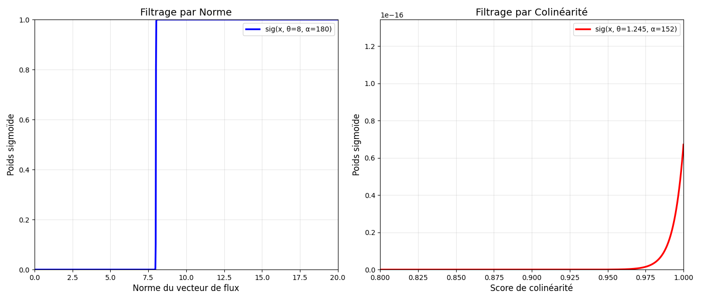
  <figcaption>Fonctions sigmoïde pour les paramètres optimaux des filtres de norme et de colinéarité</figcaption>
</figure>

On observe qu'on est resté sur un filtre "dur" pour le filtre de norme. En revanche, le filtre de colinéarité ressemble plus à une exponentielle décollant autour de 0.975.

Cette configuration atteint une performance de **39.47%**.

**Phase 3 : Optimisation du point de référence**
Une fois que mon jeu de paramètres optimal est trouvé pour le point de référence fixé au centre de l'image, je m'autorise à utiliser les points moyens des prédictions de l'expérience précédente comme nouveaux points de référence pour le calcul des scores de colinéarité.
En utilisant ces points moyens de référence, la performance s'améliore significativement à **29.77%**.

#### Phase 4 : Post-processing et lissage
J'applique ensuite différentes méthodes de lissage sur les prédictions, avec optimisation des hyperparamètres.
Dans le tableau ci-dessous, on peut observer les performances obtenues pour les deux expériences précédentes : celle qui utilise le point de référence au centre de l'image et celle qui utilise les points moyens des prédictions de l'expérience précédente.

Pour chaque expérience, on donne le score brut, puis le score lissé avec la moyenne simple et la moyenne exponentielle bi-directionnelle.

Pour les moyennes exponentielles, j'ai optimisé le paramètre α par recherche unidimensionnelle. J'ai noté les valeurs optimales dans la dernière colonne.

| Expérience | Score brut | Moyenne simple | Moyenne exponentielle bi-directionnelle | α |
|------------|-------------|------------|----------------|----------------|
| point de ref : centre | 39.47% | 18.29% | 17.63% | 0.01 |
| point de ref : moyenne | 29.77% | 10.77% | **8.58%** | 0.05 |

On observe que lisser les prédictions avec la moyenne exponentielle bi-directionnelle est systématiquement la meilleure option.

**Résultat final : 8.58%** avec la méthode de lissage exponentiel bi-directionnel.

<figure markdown>
  

    

      Point de référence : Centre de l'image 
      
    

    

      Point de référence : Moyenne de l'expérience précédente 
      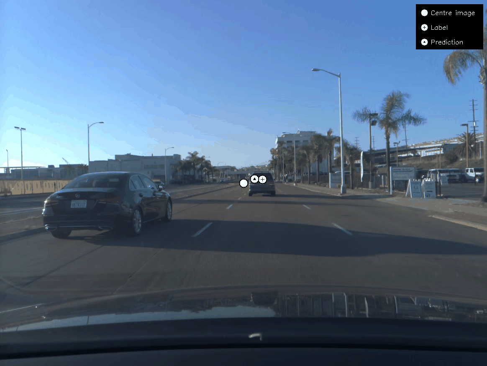
    

  

  <figcaption style="text-align: center; margin-bottom: 10px;">
    <strong>Comparaison des résultats finaux</strong>
  </figcaption>
</figure>

Sur la figure ci-dessus, visuellement, je tends à préférer la méthode utilisant le point de référence au centre de l'image car elle semble plus réactive aux changements de direction du véhicule bien que l'erreur par rapport au label soit plus élevée.
Je soupçonne par conséquent que les labels ne sont pas parfaitement fiables car trop centrés autour de leur valeur moyenne.

#### Observation annexe : Pourquoi contraindre le point de référence au centre

Une question légitime se pose : pourquoi ne pas laisser la recherche bayésienne optimiser simultanément tous les paramètres, y compris le choix du point de référence pour les scores de colinéarité ?

J'ai effectivement testé cette approche sans contraintes, mais elle a révélé un comportement problématique de l'optimiseur. Les meilleurs scores pré-lissage utilisaient systématiquement les points moyens d'expérimentations précédentes comme points de référence pour le calcul de colinéarité.

Une tendance claire émergait alors : le filtre devenait extrêmement restrictif sur les scores de colinéarité, ne conservant que les vecteurs pointant presque exactement vers le point de référence. En parallèle, le filtre sur la norme des vecteurs devenait beaucoup plus permissif, car le filtrage drastique sur la colinéarité avait déjà éliminé le bruit des petits vecteurs.

Cette stratégie produisait des estimations systématiquement proches des points moyens des expérimentations précédentes, mais paradoxalement moins performantes que la méthode de recherche contrainte que j'ai finalement retenue après lissage.

**Le piège de l'optimisation** : Ces solutions améliorent artificiellement le score en réduisant la variance autour d'un point de référence potentiellement éloigné des véritables épipoles. L'optimiseur résout le mauvais problème - plutôt que de localiser précisément l'épipole, il cherche à faire des prédictions au plus près de ce point de référence.

**Ma stratégie de séparation** : En contraignant d'abord le point de référence au centre, je force l'algorithme à trouver des paramètres qui produisent un signal certes bruité, mais non-biaisé. Le lissage peut ensuite réduire efficacement cette variance sans introduire de biais systématique. Cette approche sépare la **réduction du biais** (optimisation des paramètres) de la **réduction de la variance** (post-processing), évitant les solutions sous-optimales de l'optimisation jointe.

## Explorations annexes
### Impact du filtrage dur sur le nombre de vecteurs

Lors de mes tests avec le filtrage binaire de l'arc précédent (seuils fixes de norme ≥ 13 et colinéarité ≥ 0.96), j'ai voulu vérifier une hypothèse : le nombre de vecteurs restants après filtrage pourrait-il être corrélé avec la qualité de la prédiction ?

Pour explorer cette question, j'ai visualisé deux métriques à travers toutes les frames :
- Le nombre de vecteurs conservés après filtrage dur
- La distance entre l'épipole prédit et le label

**Observations principales :**
- Certaines vidéos (0 et 1, meilleures performances) montrent un nombre de vecteurs relativement faible mais constant
- D'autres vidéos présentent un nombre de vecteurs très variable d'une frame à l'autre
- Dans les vidéos à nombre variable, les meilleures performances semblent coïncider avec les frames ayant le plus de vecteurs

Cependant, aucune règle claire n'a émergé de cette analyse. Les corrélations attendues ne se sont pas matérialisées de manière exploitable pour améliorer le filtrage.

# Arc final : Optimisation avancée et conclusions

## Envoi des résultats
J'ai d'abord visualisé les prédictions en sortie de mon filtrage et lissage sur les cinq vidéos de test. Satisfait du résultat, je les ai envoyé à Comma.ai, confiant dans le fait que ma solution devrait avoir des performances sous la barre des 15%, mon objectif initial.
Je notais cependant qu'il y a plusieurs virages serrés dans ce jeu de données, alors qu'il n'y en avait qu'un dans les données d'entraînement. J'espérais que ça n'impacterait pas trop mes résultats. De visu, ça semblait bien fonctionner.
De toute manière, il n'y avait qu'un moyen de le savoir : envoyer mes résultats.
Après quelques jours d'attente, j'ai reçu le score de mon modèle : 30%. Aïe, douche froide ! Je ne m'attendais pas à observer une telle de perte en performances ...

"Saletés de virages !" avais-je immédiatement pensé. Et puis ensuite, une autre idée désagréable est remontée dans mon esprit. Une telle différence entre mon score sur les données d'entraînement et le score obtenu sur les données de test, ça ne laissait pas mes vieux réflexes de data scientist indifférents : j'avais overfitté !

La question flottait en fait dans mon esprit depuis quelques arcs : était-il pertinent de constituer un jeu d'évaluation pour l'algorithme que je conçevais ? pouvait-on considérer que ma recherche de paramètres pour mon filtrage et mon lissage était une forme d'apprentissage ?
étant donné le fait que je cherchais des paramètres globaux fonctionnant pour l'ensemble des frames du jeu de données, et pas des paramètres spécifiques à chaque frames, je m'étais dit que ça devrait limiter les risques de surapprentissage. Mais je supposais alors que j'avais eu tort.

<!-- Quoi qu'il en soit, une partie de moi sentait qu'on commençait à arriver aux limites des paramètres généraux. Mais je ne pouvais pas en rester là avec ma méthode actuelle. -->
il me fallait constituer un jeu d'entrainement et un jeu d'évaluation qui me permettent d'améliorer mon score sur le jeu de test !

## Conception des jeux de données

### Sélection des segments de vidéos pour la construction des jeux de données
Après un rapide coup d'œil aux frames où mon erreur était la plus élevée, il était évident qu'il y avait une forte corrélation entre les virages et une erreur élevée.

Pour analyser ce phénomène, j'ai développé une méthode basée sur la déviation par rapport au point médian :

1. **Calcul du point de référence** : Pour chaque vidéo, j'ai calculé la médiane des coordonnées (x, y) des points, séparément pour les prédictions et les labels
2. **Mesure de la déviation** : Pour chaque frame, j'ai calculé la distance euclidienne entre le point de cette frame et le point médian correspondant

Cette approche permet de visualiser comment les points s'écartent de leur position "typique" au cours de chaque vidéo. Plus intéressant encore, elle permet de détecter visuellement les virages : quand le point s'éloigne du point médian (qui est probablement proche de la trajectoire en ligne droite), cela indique un moment de virage.

Dans les visualisations ci-dessous :
- La **ligne bleue** représente les décalages verticaux : au-dessus de zéro = décalage vers le haut, en dessous = décalage vers le bas
- La **ligne rouge** représente les décalages horizontaux : au-dessus de zéro = virage à droite, en dessous = virage à gauche

<figure markdown>
  

    

      <!-- Point de référence : Centre de l'image  -->
      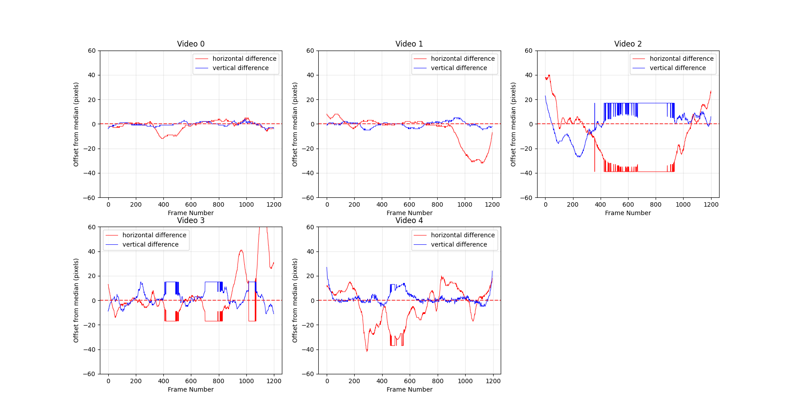
    

    

      <!-- Point de référence : Moyenne de l'expérience précédente  -->
      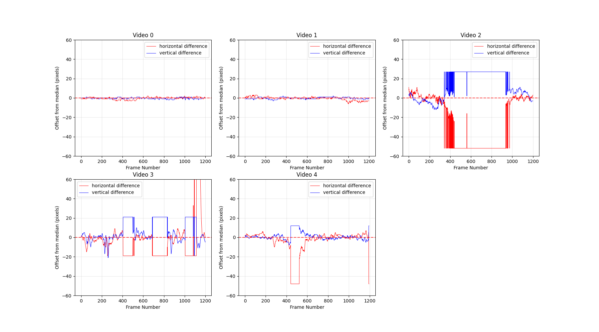
    

  

  <figcaption style="text-align: center; margin-bottom: 10px;">
    <strong>Déviation du point médian en pixels : prédictions (gauche) et labels (droite)</strong>
  </figcaption>
</figure>

Dans la figure ci-dessous, on peut observer la distance euclidienne entre la prédiction et le label pour chaque frame de chaque vidéo.

<figure markdown>
  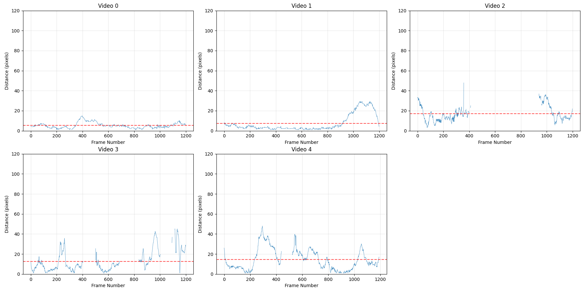
  <figcaption>Distance en pixels entre la prédiction et le label pour chaque frame de chaque vidéo</figcaption>
</figure>

Il est évident sur ces figures que les virages sont les frames où l'erreur est la plus élevée. J'ai donc décidé de constituer un jeu d'entrainement et un jeu d'évaluation qui contiennent des frames de virages.

### Constitution des jeux de données

Maintenant que j'avais identifié les passages problématiques, il fallait construire des jeux d'entraînement et de validation stratégiques.

**Principe de sélection** : J'ai isolé environ 2300 frames d'intérêt réparties en segments de 100 à 400 frames, en veillant à inclure :
- Des segments avec virages prononcés (zones d'erreur élevée)
- Des segments rectilignes (pour éviter l'overfitting sur les virages)
- Des cas particuliers comme les "dos d'âne" mal lissés

**Méthode d'échantillonnage** : Pour chaque segment sélectionné, j'ai appliqué la même stratégie de sampling par déciles qu'auparavant : division en 10 déciles et échantillonnage d'un nombre fixe de frames par décile. Cette approche garantit une représentation équilibrée de chaque segment.

**Répartition finale** :
- **Jeu d'entraînement** : 300 frames provenant des segments avec virages difficiles et zones problématiques de lissage
- **Jeu de validation** : 100 frames incluant segments rectilignes et virages non détectés par les labels

Cette approche plus ciblée me permettait d'augmenter la taille des jeux de données par rapport aux 100 échantillons précédents, tout en me concentrant sur les cas d'usage critiques.

## Expérimentations avec les nouveaux jeux de données

### Recherche bayésienne des paramètres de filtrage

Avec mes nouveaux jeux d'entraînement et de validation, j'ai relancé une recherche bayésienne pour optimiser les paramètres de filtrage. J'ai inclus mes meilleurs paramètres des arcs précédents comme points de départ pour guider la recherche. J'ai également effectué une recherche locale autour de ces paramètres pour explorer finement l'espace proche. Résultat surprenant : malgré l'exploration de centaines de combinaisons, aucune direction de recherche n'a permis d'améliorer significativement les performances sur les jeux d'entraînement ou de validation !

### Optimisation des paramètres de lissage

J'ai également testé de nouveaux paramètres de lissage sur ces jeux de données. Résultat identique : le paramètre optimal était le même que dans ma sélection précédente. Aucune amélioration n'a été apportée par l'utilisation d'un jeu d'entraînement et de validation séparés.

### Bilan et insights

**Conclusion majeure** : La division en jeux d'entraînement/validation n'a pas apporté d'amélioration significative.

**Observation clé** : En analysant les erreurs de plus près, j'ai identifié que :
- Les erreurs se concentrent massivement dans les virages
- Ma méthode prédit des écarts plus importants que les labels lors des virages
- Le lissage réduit l'amplitude des virages mais les étale temporellement

**Hypothèse finale** : Le véritable problème n'est pas l'overfitting des paramètres, mais une faiblesse fondamentale de ma méthode pour prédire la direction du véhicule dans les virages. Les virages du jeu de test sont probablement plus difficiles à prédire que ceux d'entraînement.

# Bilan et Perspectives

L'analyse des résultats révèle que la méthode développée, malgré ses optimisations successives, présente une faiblesse systématique dans les virages. Cette faiblesse ne provient pas d'un problème de paramétrage ou de surapprentissage, mais d'une confusion conceptuelle fondamentale dans l'approche initiale.

## Le Foyer d'Expansion, l'objectif caché de ma méthode

Ma démarche, basée sur la minimisation du score de colinéarité du flux optique, était en réalité conçue pour trouver un Foyer d'Expansion (FoE). Ce phénomène correspond au point unique sur l'image d'où l'intégralité du mouvement apparent de la scène semble diverger.

Cependant, le Foyer d'Expansion n'apparaît que sous une condition très stricte : un mouvement de translation pure.

## La "Contamination" du Flux Optique dans les virages

C'est cette condition qui explique l'échec de l'algorithme dans les virages. Un virage est un mouvement composé, alliant une translation à une rotation. Cette composante de rotation vient "contaminer" le champ de vecteurs du flux optique :
- La translation seule crée un flux radial qui s'éloigne du FoE.
- La rotation y superpose un flux rotationnel qui enroule les vecteurs autour d'un centre.

La combinaison des deux brise le schéma de divergence simple. En conséquence, dans un virage, le Foyer d'Expansion en tant que point de convergence unique n'existe plus.

## La Distinction avec l'Épipole

Le concept géométrique qui reste valide en toutes circonstances est celui de l'Épipole. Il s'agit de la projection du centre d'une caméra sur le plan de l'autre. Contrairement au FoE, son existence est garantie que le mouvement contienne ou non une rotation.

## Diagnostic Final

Mon erreur a donc été de développer une méthode qui estime le Foyer d'Expansion en pensant estimer l'Épipole.
- En ligne droite, les deux concepts coïncident, ce qui explique les bonnes performances de la méthode.
- En virage, l'algorithme cherchait un Foyer d'Expansion qui n'existait plus géométriquement, ce qui menait inévitablement à une estimation instable et erronée.

Cette limitation est donc fondamentale à l'approche choisie et ne peut être résolue par un simple affinage des paramètres.

## Solution envisagée : Décomposition du mouvement caméra

Une approche robuste consiste à séparer les composantes de translation et de rotation du mouvement de la caméra. Cette méthode repose sur les étapes suivantes :

- Détection de points d'intérêt sur une image
- Suivi de ces points dans l'image suivante
- Calcul de la matrice fondamentale à partir des correspondances
- Dérivation de la matrice essentielle à partir des paramètres de la caméra
- Extraction du mouvement de translation pur, isolé de la rotation

Cette approche devrait être robuste aux virages, et la majorité des composants nécessaires sont déjà disponibles dans OpenCV.

## Leçon apprise

Ma plus grande erreur stratégique fut de garder le lissage pour la fin. Je le voyais comme une "victoire facile", une cerise sur le gâteau, et j'ai donc sous-estimé son impact. C'était une double erreur.

- J'ai sous-estimé son gain. Le lissage n'était pas un petit bonus, mais une amélioration majeure. Étant rapide à implémenter, j'aurais dû commencer par là pour obtenir très tôt des résultats solides.
- J'ai mal compris son rôle. Plus important encore, le lissage n'était pas qu'une simple optimisation ; c'était mon meilleur outil de diagnostic. En supprimant le "bruit" de mes prédictions, il aurait immédiatement mis en évidence la faiblesse fondamentale de ma méthode dans les virages, m'évitant de passer des jours à perfectionner une approche limitée.

La leçon est claire : il faut toujours implémenter les solutions à fort impact et faible effort en premier. Non seulement pour la performance, mais surtout parce qu'elles clarifient le vrai problème à résoudre et permettent de savoir si les efforts plus complexes sont justifiés.

